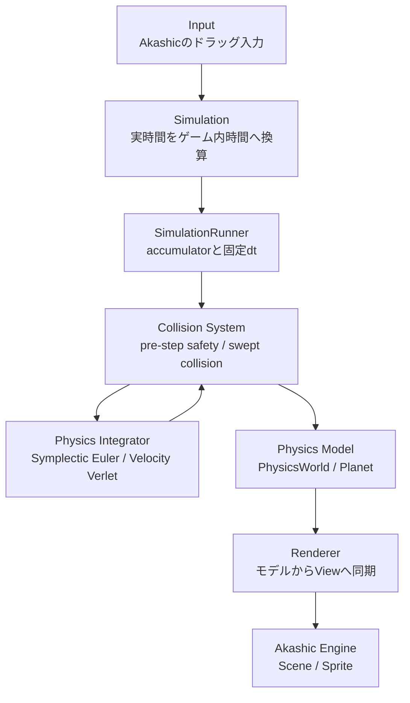

# 物理シミュレーション設計

## 責務の流れ



`Planet`、`PhysicsWorld`、重力計算、積分器、`SimulationRunner` は `g.Scene` や `g.Sprite` を参照しません。描画依存は `PlanetView` と `PlanetRenderer` が引き受けます。これにより、物理層をAkashic Engineなしで単体テストできます。

## 単位系

物理層は原則としてSI単位系を使用します。

- 位置・半径: m
- 質量: kg
- 時間: s
- 速度: m/s
- 加速度: m/s²
- 万有引力定数: m³ kg⁻¹ s⁻²

pxへの変換は `rendering.ts` だけで行い、物理モデルへpxを保存しません。

## Newtonの万有引力

天体 `i` が天体 `j` から受ける加速度は次式です。

```text
a_i,j = G * m_j / |r_j - r_i|^3 * (r_j - r_i)
```

`calculateAccelerations(bodies)` は、ある同一時刻の全位置を読み取って全加速度をまとめて返します。積分器は天体を順番に完全更新しないため、更新済み位置と更新前位置が同じ重力評価に混在しません。

同じ位置にある異なる天体間では式が特異になります。G4では登録済みの投石と中央天体について、積分前に重なりを解決または吸収してから重力を評価します。衝突対象外として新規追加した天体や、重力ソフトニングは別途考慮が必要です。

## 固定タイムステップ

`Setting.PhysicsStepSeconds` の初期値は6時間、つまり21,600秒です。物理dtを固定すると、描画fpsの揺れによって積分精度や軌道が変わることを避けやすく、同じ入力に対する再現性も高まります。

`SimulationRunner.advance(simulationSeconds)` は渡されたゲーム内時間をaccumulatorへ加算します。accumulatorが固定dt以上の間だけ `integrator.step()` を繰り返し、固定dt未満の端数は次回へ保持します。たとえば30日は次の120ステップです。

```text
30 days / 6 hours = 120 steps
```

各固定ステップは、初期重なり・吸収の安全処理、開始位置保存、積分、連続衝突解決、通知の順です。衝突系は積分器の外側にあるため、Symplectic EulerとVelocity Verletのどちらでも同じルールを使います。

## 円衝突と連続判定

ゲームプレイ用の衝突半径は描画用`Planet.radius`と分離しています。投石は0.15 AU、中央天体は0.25 AUです。固定dtが6時間と大きいため、ステップ終了位置の重なりだけでなく、相対移動に対して次の二次方程式を解きます。

```text
|relativeStart + relativeMove × t|² = (radiusA + radiusB)²
0 <= t <= 1
```

区間内の最小解を接触時刻とし、接触位置へ戻してから残り時間を衝突後速度で進めます。これにより、1ステップ中に両者の位置が入れ替わる高速衝突も検出します。

投石同士は法線方向へ反発係数0.9のインパルスを適用します。逆質量を使う一般式なので異なる質量にも対応し、接線方向速度は変更しません。分離中の接触には再度インパルスを加えず、めり込みだけを逆質量比で補正します。

中央天体との接触は反発ではなく吸収です。接触した投石を`PhysicsWorld`と衝突対象一覧から除外するため、以後は重力源にもなりません。中央天体の位置・速度・質量は吸収によって変更しません。

## 描画周期との分離

Akashicの更新周期は実時間ベース、物理積分はゲーム内時間ベースです。1フレームの処理順は次のとおりです。

```text
Akashic update
  -> 実時間をゲーム内時間へ換算
  -> 0回以上の固定物理step
  -> PlanetRenderer.update()を1回
```

6時間ごとのサブステップではSpriteを操作しません。初期の `Setting.SimulationSecondsPerSecond` は実時間1秒で900日分であり、30fpsでは従来と同じく1フレームあたり約30日進みます。物理dtと見た目の進行速度は別設定です。

## Symplectic Euler

`SymplecticEulerIntegrator` は次の順で更新します。

1. 現在位置から全天体の `a(t)` を計算する
2. 全天体の速度を `v(t+dt) = v(t) + a(t) dt` で更新する
3. 更新後の全速度で位置を `x(t+dt) = x(t) + v(t+dt) dt` と更新する

通常の陽的Euler法より軌道問題の長期的な性質を保ちやすく、計算量も比較的小さい方式です。本プロジェクトでは既存挙動との連続性のため既定値にしています。

## Velocity Verlet

`VelocityVerletIntegrator` は次の順で更新します。

1. 現在位置から全天体の `a(t)` を計算する
2. 全天体の位置を `x(t+dt) = x(t) + v(t)dt + 0.5 a(t)dt²` で更新する
3. 更新後の全位置から全天体の `a(t+dt)` を再計算する
4. 全天体の速度を `v(t+dt) = v(t) + 0.5(a(t)+a(t+dt))dt` で更新する

位置を2次精度で扱い時間対称性を持つ一方、1ステップで重力を2回評価します。どの条件でも必ずSymplectic Eulerより良いとは限りません。

## 積分器の切り替え

`src/setting.ts` の `Setting.IntegratorKind` を変更します。

```ts
static get IntegratorKind(): PhysicsIntegratorKind {
    return PhysicsIntegratorKind.VelocityVerlet;
}
```

どちらの積分器も同じ `IPhysicsIntegrator.step(world, dt)` と `PhysicsWorld` を使用します。実行中の切り替えが必要になった場合は `SimulationRunner.setIntegrator()` を使用できますが、今回は切り替えUIを提供しません。

## 時間設定の変更

- 物理精度・計算量を変える: `Setting.PhysicsStepSeconds`
- 見た目の時間進行速度を変える: `Setting.SimulationSecondsPerSecond`

両者は独立しています。物理dtを小さくすると同じゲーム内時間を進めるステップ数が増えます。シミュレーション速度だけを上げても固定dtは変化しません。

## ドラッグ速度の分離

ドラッグ量から初速度への換算は `calculateLaunchVelocity()` が担当します。換算には `Setting.InputVelocityReferenceSeconds` と `Setting.DragVelocityDivisor` を使い、最後に `Setting.LaunchVelocityMultiplier`（現在は1.5）を掛けます。`PhysicsStepSeconds` は参照しないため、物理dtを変更しても操作感が直接変化しません。

## 本番物理を使う軌道予測

`TrajectoryPredictor`は簡易式や粗いdtを使わず、現在の`PhysicsWorld`をdeep cloneして、本番と同じ`PhysicsIntegratorKind`、6時間dt、10年を別の`SimulationRunner`で計算します。衝突系も天体参照をclone側へ対応付けて複製するため、activeStoneの表示予測に投石反発と中央吸収が反映されます。`PhysicsWorld.cloneWithMapping()`が元の`Planet`参照からclone側の対応天体を返すため、予測対象を配列indexの意味に依存せず指定できます。

clone側のmass、radius、position、velocity、accelerationはすべて独立しています。仮のlaunch velocityと14,600回の予測ステップはcloneだけへ適用され、本番世界へ副作用を与えません。

予測と実軌跡の物理状態は6時間ごとに更新しますが、`TrajectoryRecorder`は10ゲーム日ごとの`TrajectoryPoint`だけを保存します。samplingは描画量と履歴量だけを削減し、積分結果は変えません。`SimulationRunner.advance()`の任意after-stepコールバックを記録に使い、Integratorは物理計算だけを担当します。

## 将来の拡張ポイント

- 予測難易度: 現在の10年予測期間を難易度別に変更するUIを追加する
- 早送り・低速化: `SimulationSecondsPerSecond` 相当のランタイム倍率をSimulation層へ追加する
- 一時停止: `advance()` に渡すゲーム内時間を0にする
- 描画補間: accumulatorの割合をView用に使い、物理状態を変更せず補間表示する
- 複数同時衝突: 反復ソルバーや衝突時刻順のイベントキューへ拡張する

これらは拡張点の説明であり、現時点では実装していません。

## 数値誤差とdtの限界

数値積分には打ち切り誤差と浮動小数点誤差があります。6時間dtは現時点の初期値であり、近接遭遇、高速運動、質量比の異なるあらゆる軌道条件に十分な精度を保証するものではありません。条件を変更した場合は、エネルギー誤差、軌道の発散、NaN/Infinityの有無を回帰テストまたは診断で確認してください。
